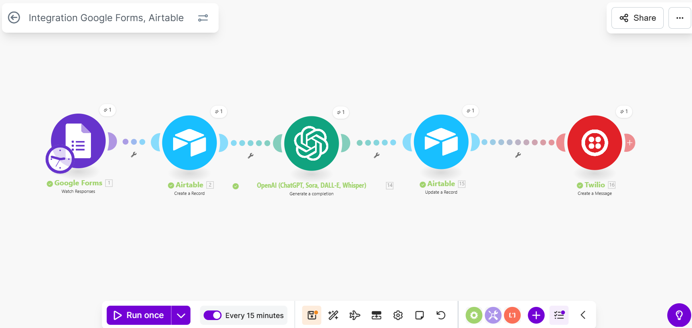
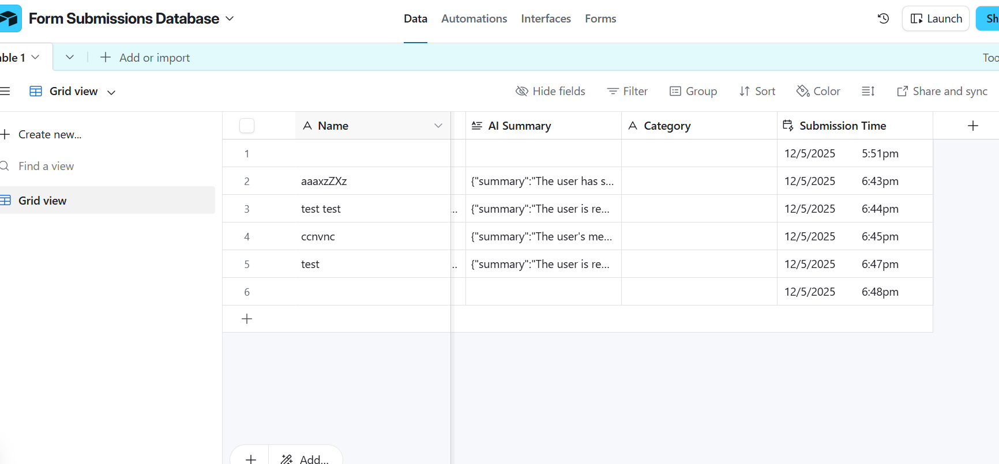
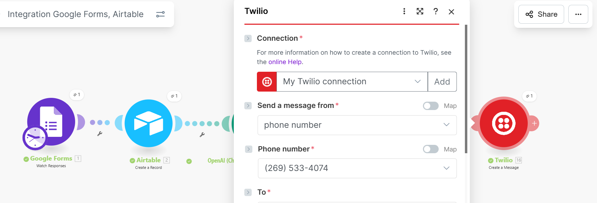

**Project Title: Lead Automation System – Form → Airtable → AI Categorization → WhatsApp Notification**


# 📌 **Lead Automation System**

This project is a **no-code lead automation workflow** built using **Make (Integromat), Airtable, OpenAI, and WhatsApp Cloud API**.

It automatically:

1. **Captures leads** from an online form
2. **Stores them in Airtable** (acts as a CRM)
3. **Uses AI to generate a summary + category**
4. **Sends instant WhatsApp notifications**

This workflow ensures you never miss important inquiries and can respond to leads quickly and professionally.

---

# 🚀 **Workflow Overview**

### **1️⃣ Form Submission**

Users submit a message through an online form (Typeform / Jotform / Google Form — any source).  
This becomes the trigger.

### **2️⃣ Airtable – Store the Lead**

The message is inserted into Airtable with these fields:

* Name
* Email
* Message
* Timestamp
* AI Summary
* AI Category

### **3️⃣ OpenAI – AI Summary + Categorization**

Using OpenAI’s API, the message is converted into:

```json
{
  "summary": "Short 1–2 sentence resumen of what the lead wants.",
  "category": "job | support | sales | general"
}
 ```

### **4️⃣ WhatsApp Notificati on**

A WhatsApp template message is automatically sent to your number containing:

Lead details

  Summary

  Category

  Quick action steps

This lets you reply instantly.

## 🛠️ Tech Stack
Tool	Purpose
Make (Integromat)	Automation workflow
Airtable	Lead CRM database
OpenAI	AI message processing
WhatsApp Cloud API	Notifications
(Optional) Typeform/Jotform	Lead collection form



